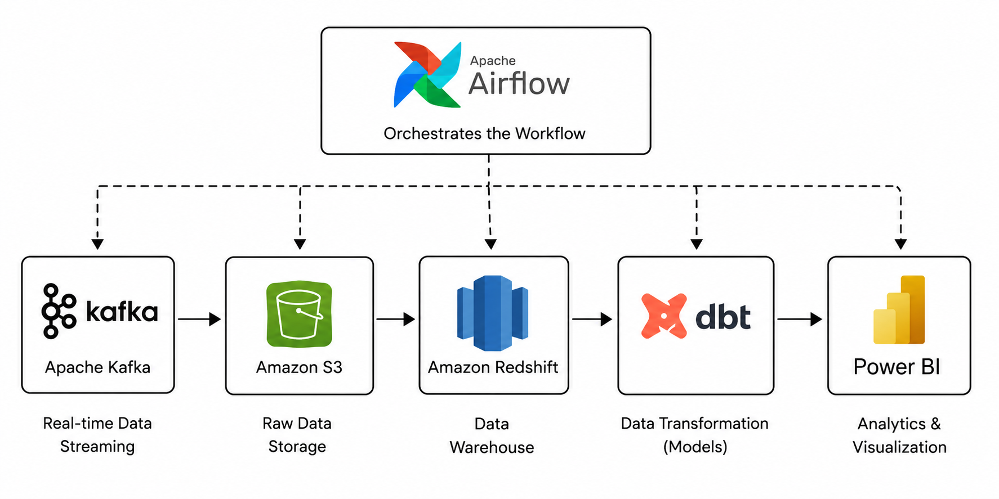

# 🛒 Stream Store — Real-Time E-Commerce Analytics Pipeline


 

## 📋 Table of Contents

1. [Project Overview](#1-project-overview)
2. [Architecture Diagram](#2-architecture-diagram)
3. [Technology Stack](#3-technology-stack)
4. [Repository Structure](#4-repository-structure)
5. [Data Flow — Step by Step](#5-data-flow--step-by-step)
6. [dbt Data Models](#6-dbt-data-models)
   - 6.1 [Bronze Layer — `stream_store_raw`](#61-bronze-layer--stream_store_raw)
   - 6.2 [Silver Layer — `stream_store_stg`](#62-silver-layer--stream_store_stg)
   - 6.3 [Gold Layer — `dim_customer`](#63-gold-layer--dim_customer)
   - 6.4 [Gold Layer — `dim_product`](#64-gold-layer--dim_product)
   - 6.5 [Gold Layer — `fct_order`](#65-gold-layer--fct_order)
7. [Data Quality Checks](#7-data-quality-checks)
8. [Airflow Connections and Variables](#8-airflow-connections-and-variables)
9. [Dataset Schema](#9-dataset-schema)
10. [S3 Partitioning Strategy](#10-s3-partitioning-strategy)
11. [Power BI Dashboard](#11-Power-BI-Dashboard)
12. [Scaling Considerations](#12-scaling-considerations)
13. [Troubleshooting Guide](#13-troubleshooting-guide)
14. [Glossary](#14-glossary)


---

## 1. Project Overview

**Stream Store** is a real-time streaming analytics pipeline built to simulate the operational data infrastructure behind a modern e-commerce platform. The pipeline continuously ingests order records from a CSV dataset (acting as a stand-in for a live transactional system), streams them through Apache Kafka, buffers and persists them to Amazon S3, loads the raw data into Amazon Redshift, and transforms it through a structured dbt Bronze → Silver → Gold architecture.

The end result is a dashboard that visualizes the business insights and answers the following questions:

- Which coustomers are generating the most revenue?
- What are the most frequently purchased products?
- What are top products with the highest revenue?
- Which payment methods are most popular?
- What is the daily revenue trend?
- What is the most common order status?

### Key Design Goals

| Goal | Implementation |
|------|---------------|
| Simulate real-time ingestion | Kafka producer streams rows per DAG run with offset tracking |
| Fault-tolerant delivery | Consumer only commits Kafka offsets after successful S3 write |
| Idempotent storage | S3 keys are timestamped and batch-indexed to prevent collisions |
| Separation of concerns | Distinct Python modules for produce, consume, load, and transform |
| Declarative transformation | dbt SQL models with clear layering (bronze/silver/gold) |
| Observable pipeline | Airflow task-level logging with structured output metrics |
| Data quality enforcement | Post-transform SQL checks that fail the DAG on bad data |

### Business Context

The dataset represents a fictional online retailer called **Stream Store** selling across six countries: the United States, the United Kingdom, Canada, France, Denmark, and Australia. Orders carry product category, payment method, quantity, price, and fulfillment status — a realistic schema for e-commerce analytics.

---

## 2. Architecture Diagram

```
┌─────────────────────────────────────────────────────────────────────────────┐
│                          APACHE AIRFLOW (Orchestrator)                       │
│                                                                               │
│   ┌───────────┐    ┌───────────┐    ┌──────────────┐    ┌────────────────┐  │
│   │  PRODUCE  │───▶│  CONSUME  │───▶│    LOAD TO   │───▶│  DBT TRANSFORM │  │
│   │  (Kafka)  │    │  (S3)     │    │   REDSHIFT   │    │  + DQ CHECKS   │  │
│   └───────────┘    └───────────┘    └──────────────┘    └────────────────┘  │
└──────┬────────────────────┬──────────────────┬──────────────────┬───────────┘
       │                    │                  │                  │
       ▼                    ▼                  ▼                  ▼
┌────────────┐    ┌──────────────────┐  ┌───────────┐   ┌───────────────────┐
│   orders   │    │  Amazon S3       │  │ Amazon    │   │ dbt Models        │
│   .csv     │    │                  │  │ Redshift  │   │                   │
│            │    │  streamstore/    │  │           │   │ Bronze:           │
│  8 rows    │    │  year_YYYY_      │  │ stream_   │   │  stream_store_raw │
│  per run   │    │  month_MM_       │  │ store_raw │   │                   │
│            │    │  day_DD_         │  │           │   │ Silver:           │
│  (offset   │    │  batch_*.csv     │  │           │   │  stream_store_stg │
│  tracked   │    │                  │  │           │   │                   │
│  in        │    │                  │  │           │   │ Gold:             │
│  Airflow   │    │                  │  │           │   │  dim_customer     │
│  Variable) │    │                  │  │           │   │  dim_product      │
└────────────┘    └──────────────────┘  └───────────┘   │  fct_order       │
       │                    ▲                            └───────────────────┘
       │                    │
       ▼                    │
┌──────────────┐   ┌────────────────┐
│ Apache Kafka │──▶│  Kafka         │
│              │   │  Consumer      │
│ Topic:       │   │  (batch flush  │
│ stream_store │   │  every 8 rows  │
│ _topic       │   │  or 30s)       │
└──────────────┘   └────────────────┘
```

### Data Lineage Summary

```
orders.csv
    │
    │ (producer.py — 8 rows/run, offset-tracked)
    ▼
Kafka Topic: stream_store_topic
    │
    │ (consumer.py — batch 8 rows, flush to S3)
    ▼
S3: s3://streamstore-*/streamstore/year_*_month_*_day_*_batch_*.csv
    │
    │ (redshift_loader.py — COPY command via IAM role)
    ▼
Redshift: public.stream_store_raw
    │
    │ (dbt Bronze)
    ▼
dbt view: stream_store_raw (SELECT * pass-through)
    │
    │ (dbt Silver — cleaning, casting, deduplication)
    ▼
dbt table: stream_store_stg
    │
    ├──▶ dbt table: dim_customer   (customer_id, name, country)
    ├──▶ dbt table: dim_product    (product_id, category)
    └──▶ dbt table: fct_order      (transaction, dates, keys, amounts)
    ▼
Power BI: Dashboard
    │
    │──▶ Business Insights
    
```

---

## 3. Technology Stack

| Layer | Tool / Service | Version / Notes |
|-------|---------------|-----------------|
| **Orchestration** | Apache Airflow | 2.x, Docker-based |
| **Message Broker** | Apache Kafka | Confluent distribution, `kafka:9092` |
| **Streaming Client** | `confluent-kafka` | Python client |
| **Object Storage** | Amazon S3 | `ap-south-1` region |
| **Data Warehouse** | Amazon Redshift Serverless | `ap-south-1` region |
| **Transformation** | dbt (data build tool) | Postgres/Redshift adapter |
| **Python Libraries** | `boto3`, `psycopg2`, `confluent-kafka` | See requirements below |
| **Infrastructure** | Docker / Docker Compose | Local broker + Airflow |
| **Cloud Auth** | AWS IAM Roles + Airflow Connections | Least-privilege |
| **Data Format** | CSV (in-flight), Redshift columnar (at rest) | |
| **BI Tool** |Power BI | Dashboard | 

### Python Dependencies

```
apache-airflow>=2.7.0
apache-airflow-providers-postgres
confluent-kafka>=2.3.0
boto3>=1.34.0
botocore>=1.34.0
psycopg2-binary>=2.9.0
dbt-redshift>=1.7.0
```

---

## 4. Repository Structure

```
stream-store-pipeline/
│
├── dags/
│   └── main.py                      # Airflow DAG definition
│
├── services/
│   ├── producer.py                  # Kafka producer (CSV → Kafka)
│   ├── consumer.py                  # Kafka consumer (Kafka → S3)
│   ├── redshift_loader.py           # S3 → Redshift COPY
│   └── dbt_layers.py                # dbt runner + data quality checks
│
├── dbt/
│   ├── dbt_project.yml              # dbt project config
│   ├── profiles.yml                 # Redshift connection profile
│   │
│   └── models/
│       ├── bronze/
│       │   └── stream_store_raw.sql # Pass-through view from raw table
│       │
│       ├── silver/
│       │   └── stream_store_stg.sql # Cleaned, cast, deduplicated staging
│       │
│       └── gold/
│           ├── dim_customer.sql     # Customer dimension
│           ├── dim_product.sql      # Product dimension
│           └── fct_order.sql        # Order fact table
│
├── data/
│   └── stream_dataset.csv           # Source dataset (500 rows)
│
├── docker-compose.yml               # Kafka + Zookeeper + Airflow setup
├── requirements.txt                 # Python dependencies
└── README.md                        # This file
```

---

## 5. Data Flow — Step by Step

Understanding the exact sequence of operations in a single DAG run is essential before touching any configuration. Here is a complete walkthrough of one pipeline execution.

### Step 1 — DAG Trigger

Airflow triggers `kafka_to_s3` on its `@daily` schedule. The five tasks execute sequentially due to the `>>` dependency chain defined at the bottom of `main.py`.

### Step 2 — `produce_data` Task

The `PythonOperator` calls `producer.py:produce_data()`:

1. Reads the Airflow Variable `csv_offset` (e.g., `0` on first run, `8` on second).
2. Opens `/opt/airflow/data/stream_dataset.csv`.
3. Skips all rows before the stored offset using a loop counter.
4. Sends the next `ROWS_PER_RUN` (8) rows to the Kafka topic `stream_store_topic` as JSON-encoded byte strings.
5. Calls `producer.flush(20)` to ensure all messages are acknowledged by the broker.
6. Increments `csv_offset` by the number of rows actually sent and saves it back to the Airflow Variable.
7. Returns a dict `{"rows_sent": 8, "next_offset": 8}` which Airflow stores as XCom.

### Step 3 — `consume_data` Task

The `PythonOperator` calls `consumer.py:consume_data()`:

1. Builds a `boto3` S3 client from the `aws_default` Airflow Connection.
2. Creates a Confluent Kafka `Consumer` subscribed to `stream_store_topic`.
3. Enters a polling loop with a 1-second timeout per call.
4. Accumulates messages in an in-memory `batch` list.
5. Flushes to S3 when either:
   - The batch reaches `BATCH_SIZE` (8 rows), **or**
   - `BATCH_TIMEOUT_S` (30 seconds) have elapsed since the last flush.
6. After a successful S3 write, commits the Kafka consumer offset so messages are not reprocessed on restart.
7. Exits when no new messages arrive for `CONSUMER_IDLE_TIMEOUT_S` (30 seconds).
8. Performs a final flush of any remaining partial batch before closing.

### Step 4 — `load_data_to_redshift` Task

The `PythonOperator` calls `redshift_loader.py:load_data_from_s3_to_redshift()`:

1. Connects to Redshift Serverless using `psycopg2` via credentials from the `redshift_conn` Airflow Connection.
2. Executes a `CREATE TABLE IF NOT EXISTS` for `stream_store_raw` with the correct column definitions.
3. Reads `s3_path` and `iam_role` from Airflow Variables.
4. Runs a `COPY` command to bulk-load all CSV files from the S3 prefix into `stream_store_raw`.


### Step 5 — `dbt_transformations` Task

The `PythonOperator` calls `dbt_layers.py:run_dbt_layers()`:

1. Iterates over `["bronze", "silver", "gold"]`.
2. For each layer, shells out to `dbt run --select <layer>` via `subprocess.run`.
3. Captures stdout/stderr and logs them to the Airflow task log.
4. Raises an exception if the return code is non-zero, failing the task.

### Step 6 — `data_quality_checks` Task

The `PythonOperator` calls `dbt_layers.py:check_data_quality()`:

1. Connects to Redshift via the `redshift_conn` Airflow Connection using `PostgresHook`.
2. Runs three SQL assertions against the final gold layer tables.
3. Raises a `ValueError` if any check returns a count greater than zero.

---


## 6. dbt Data Models

The dbt models implement the **Medallion Architecture** (Bronze / Silver / Gold), a widely adopted pattern in modern data engineering.

### 6.1 Bronze Layer — `stream_store_raw`

**File:** `models/bronze/stream_store_raw.sql`

```sql
{{ config(materialized='view', tags=['bronze']) }}

SELECT *
FROM public.stream_store_raw
```

**Materialization:** `view` (no physical data copy — just a pointer)

**Purpose:** The bronze layer is a transparent wrapper over the raw Redshift table. It exists to:

- Decouple downstream models from the physical table name.
- Allow the raw table to be renamed or restructured without touching Silver/Gold models.
- Provide a consistent tagging point for Airflow's `--select bronze` invocation.

Because it is materialized as a `view`, it adds zero storage cost and always reflects the latest state of `stream_store_raw`.

---

### 6.2 Silver Layer — `stream_store_stg`

**File:** `models/silver/stream_store_stg.sql`

**Materialization:** `table` (materialized physically for query performance)

The staging model is the most complex transformation in the pipeline. It applies four categories of data cleansing in two CTEs:

#### CTE 1: `cleaned`

**Type casting:**

```sql
CAST(order_date AS DATE) AS order_date,
CAST(customer_id AS VARCHAR(10)) AS customer_id,
CAST(product_id AS VARCHAR(10)) AS product_id
```

Raw data arrives from CSV where every column is a string. Explicit casting ensures correct types throughout the dimensional model.

**Country standardization:**

```sql
CASE
    WHEN country IN ('US', 'UK', 'Canada', 'France', 'Denmark', 'Australia')
        THEN country
    ELSE 'unknown'
END AS country
```

Any country value not in the approved list is replaced with `'unknown'` rather than being dropped. This preserves row counts while flagging anomalies for investigation.

**Quantity repair:**

```sql
CASE
    WHEN quantity > 0 THEN quantity
    ELSE 1
END AS quantity
```

Zero or negative quantities are replaced with 1 as a conservative default. Combined with the data quality check that fails on negative quantities at the raw layer, this transform handles edge cases that survive into the Silver layer.

**Date filtering:**

```sql
WHERE customer_id IS NOT NULL
  AND order_date::DATE <= CURRENT_DATE
```

Removes rows with null customer IDs (orphaned orders) and future-dated orders (which likely indicate data entry errors or timezone issues).

#### CTE 2: `deduplicated`

```sql
ROW_NUMBER() OVER (
    PARTITION BY transaction
    ORDER BY order_date DESC
) AS rn
```

Because the COPY command loads from the entire S3 prefix on each run, rows from previous DAG runs are loaded again each time. The `ROW_NUMBER()` window function assigns `rn=1` to the most recent version of each transaction (by `order_date`). The outer `WHERE rn = 1` filter keeps only the canonical record.

---

### 6.3 Gold Layer — `dim_customer`

**File:** `models/gold/dim_customer.sql`

```sql
{{ config(materialized='table') }}

SELECT DISTINCT
    customer_id,
    customer_name,
    country
FROM {{ ref('stream_store_stg') }}
```

The customer dimension extracts the three customer-describing attributes. `SELECT DISTINCT` ensures one row per unique combination of `(customer_id, customer_name, country)`.

**Analyst use cases:**
- Join to `fct_order` on `customer_id` to get revenue by country.
- Count distinct customers per country for market penetration analysis.
- Filter orders by country in dashboards.

---

### 6.4 Gold Layer — `dim_product`

**File:** `models/gold/dim_product.sql`

```sql
{{ config(materialized='table') }}

SELECT DISTINCT
    product_id,
    product_category
FROM {{ ref('stream_store_stg') }}
```

The product dimension captures the two product-describing attributes available in the dataset. In a richer schema, this would include product name, SKU, brand, and price tier.

**Analyst use cases:**
- Join to `fct_order` on `product_id` to get revenue by category.
- Identify which categories drive the highest order volumes.

---

### 6.5 Gold Layer — `fct_order`

**File:** `models/gold/fct_order.sql`

```sql
{{ config(materialized='table') }}

SELECT DISTINCT
    transaction,
    order_date,
    customer_id,
    product_id,
    quantity,
    price,
    quantity * price AS total_amount,
    payment_method,
    order_status
FROM {{ ref('stream_store_stg') }}
```

The fact table is the central analytical table. Key design decisions:

- **Foreign keys** (`customer_id`, `product_id`) link to the dimension tables for star-schema joins.
- **`total_amount`** is a derived metric computed inline (`quantity * price`) rather than stored in the raw data. This ensures it is always consistent with the source columns.
- **`SELECT DISTINCT`** provides a second layer of deduplication on top of the Silver layer's `ROW_NUMBER()` approach.
- **Grain:** One row per unique `transaction` ID.

**Common analytical queries:**

```sql
-- Daily revenue
SELECT order_date, SUM(total_amount) AS revenue
FROM stream_schema.fct_order
GROUP BY order_date
ORDER BY order_date;

-- Revenue by country (star schema join)
SELECT c.country, SUM(f.total_amount) AS revenue
FROM stream_schema.fct_order f
JOIN stream_schema.dim_customer c USING (customer_id)
GROUP BY c.country
ORDER BY revenue DESC;

-- Top product categories by volume
SELECT p.product_category, COUNT(*) AS order_count, SUM(f.quantity) AS units
FROM stream_schema.fct_order f
JOIN stream_schema.dim_product p USING (product_id)
GROUP BY p.product_category
ORDER BY order_count DESC;
```

---

## 7. Data Quality Checks

After dbt transforms complete, three automated SQL assertions validate the integrity of the gold-layer data. Any failure halts the pipeline and prevents stale or corrupted data from reaching downstream consumers.

### Check 1: Duplicate Transactions

```sql
SELECT COUNT(*)
FROM (
    SELECT transaction
    FROM stream_schema.fct_order
    GROUP BY transaction
    HAVING COUNT(*) > 1
) t
```

**What it catches:** If the deduplication in the Silver layer failed (e.g., due to a dbt model error or a schema change), duplicate transaction IDs would produce overcounted revenue in dashboards.

**Expected result:** `0`

---

### Check 2: Invalid Country Codes

```sql
SELECT COUNT(*)
FROM stream_schema.dim_customer
WHERE country NOT IN ('US', 'UK', 'Canada', 'France', 'Denmark', 'Australia')
```

**What it catches:** The Silver layer converts unknown countries to `'unknown'`. This check verifies that no `'unknown'` values slipped through — or more precisely, that there are no country values outside the approved set (including `'unknown'`).

> **Note:** If `'unknown'` is an acceptable sentinel value, modify this check to also allow `'unknown'`, or use a separate check specifically for `'unknown'` counts with a threshold.

**Expected result:** `0`

---

### Check 3: Negative Quantities

```sql
SELECT COUNT(*)
FROM stream_schema.fct_order
WHERE quantity < 0
```

**What it catches:** The Silver layer replaces zero/negative quantities with `1`. This check verifies the replacement worked. A non-zero result indicates a bug in the Silver model logic.

**Expected result:** `0`

---

## 8. Airflow Connections and Variables

### Connections

Navigate to **Admin → Connections** in the Airflow UI and create the following:

#### `aws_default`

| Field | Value |
|-------|-------|
| Connection Id | `aws_default` |
| Connection Type | `Amazon Web Services` |
| Login | `<Your AWS Access Key ID>` |
| Password | `<Your AWS Secret Access Key>` |
| Extra | `{"region_name": "ap-south-1", "s3_bucket": "streamstore-<account-id>-ap-south-1-an"}` |


#### `redshift_conn`

| Field | Value |
|-------|-------|
| Connection Id | `redshift_conn` |
| Connection Type | `Postgres` |
| Host | `host` |
| Schema | `dev` |
| Login | `admin` |
| Password | `<Your Redshift Password>` |
| Port | `5439` |

---

### Variables

Navigate to **Admin → Variables** and create:

| Key | Initial Value | Description |
|-----|--------------|-------------|
| `csv_offset` | `0` | Tracks how many CSV rows have been produced to Kafka. Auto-increments by 8 per run. |
| `s3_path` | `s3_path/` | S3 prefix for the COPY command. |
| `iam_role` | `iam role arn` | IAM role ARN for Redshift → S3 access. |

---

## 9. Dataset Schema

The source file `stream_dataset.csv` contains 500 rows of simulated e-commerce order data with the following schema:

| Column | Type | Example | Notes |
|--------|------|---------|-------|
| `transaction` | VARCHAR(20) | `TXN-001234` | Unique order identifier |
| `order_date` | DATE | `2024-03-15` | Date order was placed |
| `customer_id` | INTEGER | `1042` | Unique customer identifier |
| `customer_name` | VARCHAR(100) | `Jane Smith` | Full name |
| `country` | VARCHAR(50) | `US` | One of: US, UK, Canada, France, Denmark, Australia |
| `product_id` | INTEGER | `501` | Unique product identifier |
| `product_category` | VARCHAR(50) | `Electronics` | Product category |
| `quantity` | INTEGER | `2` | Units ordered (should be > 0) |
| `price` | NUMERIC(10,2) | `49.99` | Unit price in USD |
| `payment_method` | VARCHAR(50) | `Credit Card` | Payment instrument |
| `order_status` | VARCHAR(20) | `Delivered` | Order fulfillment status |

### Sample Data

```
transaction,order_date,customer_id,customer_name,country,product_id,product_category,quantity,price,payment_method,order_status
TXN-001001,2024-01-05,1001,Alice Johnson,US,201,Electronics,2,149.99,Credit Card,Delivered
TXN-001002,2024-01-06,1002,Bob Williams,UK,305,Clothing,1,34.50,PayPal,Shipped
TXN-001003,2024-01-07,1003,Claire Dupont,France,102,Books,3,12.99,Credit Card,Processing
```

---

## 10. S3 Partitioning Strategy

The current implementation uses a **flat prefix with embedded date strings**:

```
streamstore/
  year_2024_month_01_day_05_batch_20240105_143022_0001.csv
  year_2024_month_01_day_05_batch_20240105_143052_0002.csv
  year_2024_month_01_day_06_batch_20240106_091533_0001.csv
```

**Advantages of this approach:**
- Simple to implement.
- All files under one prefix, making `COPY FROM 's3://bucket/streamstore/'` easy.
- Date is visible without reading file contents.

Then generate a manifest file per run listing only new files, and use `COPY FROM 's3://bucket/manifest.json' MANIFEST`.

---

## 11.
---

## 11 Power BI Dashboard

The final consumer of the pipeline is a **Power BI dashboard** connected directly to the Amazon Redshift gold-layer models via the native Redshift connector. Because Power BI reads from `dim_customer`, `dim_product`, and `fct_order` — all fully cleaned, deduplicated, and business-ready — no additional transformation is needed inside Power BI itself. All measures are computed from the tables as-is.

---

### Connecting Power BI to Redshift

1. Open Power BI Desktop → **Get Data → Amazon Redshift**.
2. Enter your Redshift Serverless endpoint and database name:
   ```
   Server  : default-workgroup.<account-id>.ap-south-1.redshift-serverless.amazonaws.com:5439
   Database: dev
   ```
3. Select **DirectQuery** (recommended for a live streaming pipeline — ensures the dashboard always reflects the latest DAG run) or **Import** for faster rendering on small datasets.
4. Load the three gold-layer tables from `stream_schema`:
   - `stream_schema.fct_order`
   - `stream_schema.dim_customer`
   - `stream_schema.dim_product`
5. Define relationships in the **Model** view:
   - `fct_order[customer_id]` → `dim_customer[customer_id]` (Many-to-One)
   - `fct_order[product_id]` → `dim_product[product_id]` (Many-to-One)

---

### Data Model Inside Power BI

```
dim_customer                fct_order                  dim_product
─────────────               ──────────────────────      ─────────────
customer_id  ◄──────────── customer_id                 product_id
customer_name               product_id  ───────────►   product_id
country                     transaction                 product_category
                            order_date
                            quantity
                            price
                            total_amount
                            payment_method
                            order_status
```

All visuals in the dashboard are built on top of this star schema. Joins are resolved by Power BI at query time using the defined relationships.

---

### DAX Measures

The following DAX measures power the KPI cards and visuals:

```dax
Total Revenue =
    SUM(fct_order[total_amount])

Total Quantity Sold =
    SUM(fct_order[quantity])

Total Orders =
    DISTINCTCOUNT(fct_order[transaction])

Total Products =
    DISTINCTCOUNT(fct_order[product_id])
```

---

### Dashboard Visuals

#### KPI Cards — At-a-Glance Business Metrics

Four KPI cards sit at the top of the dashboard and provide an instant snapshot of overall pipeline output.

| KPI Card | DAX Measure | Description |
|----------|------------|-------------|
| **Total Revenue** | `SUM(fct_order[total_amount])` | Cumulative revenue across all orders loaded to date |
| **Quantity Sold** | `SUM(fct_order[quantity])` | Total units sold across all transactions |
| **Orders Count** | `DISTINCTCOUNT(fct_order[transaction])` | Number of unique orders processed |
| **Product Count** | `DISTINCTCOUNT(fct_order[product_id])` | Number of distinct products that have been ordered |

These cards update automatically after each DAG run loads new rows into Redshift (in DirectQuery mode, a dashboard refresh is sufficient; in Import mode, trigger a dataset refresh in Power BI Service).

---

#### Payment Method Distribution — Donut / Pie Chart

**Visual type:** Donut chart

**Fields:**
- Legend: `fct_order[payment_method]`
- Values: `Total Orders` (measure)

**What it shows:** The share of transactions handled by each payment instrument (e.g., Credit Card, PayPal, Bank Transfer). This visual helps identify which payment methods are most trusted by customers across geographies, and can flag if a payment provider goes down (its slice disappears from new runs).

**Insight example:** If Credit Card consistently accounts for 60%+ of transactions, the business should prioritise fraud detection investment there.

---

#### Order Status Distribution — Bar / Donut Chart

**Visual type:** Clustered bar chart or donut chart

**Fields:**
- Axis / Legend: `fct_order[order_status]`
- Values: `Total Orders` (measure)

**What it shows:** The breakdown of orders by fulfillment status — typically across values like `Delivered`, `Shipped`, `Processing`, `Cancelled`. A healthy pipeline should show `Delivered` as the dominant status, with `Processing` and `Shipped` representing in-flight orders proportional to average fulfillment time.

**Insight example:** A sudden spike in `Cancelled` orders across consecutive DAG runs would indicate a fulfilment or inventory problem worth investigating upstream.

---

#### Revenue Trend by Day of Week — Line / Column Chart

**Visual type:** Clustered column chart

**Fields:**
- Axis: Day of week derived from `fct_order[order_date]`
- Values: `Total Revenue` (measure)

**Power BI column for day of week:**
```dax
Day of Week = FORMAT(fct_order[order_date], "dddd")
```

Or use Power BI's built-in date hierarchy to drill from year → month → day name.

**What it shows:** Which days of the week generate the highest revenue. E-commerce businesses typically see peaks on weekdays (especially Monday and Thursday) with a dip on weekends, though this varies significantly by product category and customer geography.

**Insight example:** If weekday revenue is consistently 3× weekend revenue, marketing spend should be concentrated Monday–Friday for maximum conversion efficiency.

---

#### Top Customers by Revenue & Sales Volume — Table or Bar Chart

**Visual type:** Table with conditional formatting, or a dual-axis bar chart

**Fields:**
- Rows: `dim_customer[customer_name]` (or `dim_customer[customer_id]`)
- Column 1: `Total Revenue` (measure) — shows monetary value per customer
- Column 2: `Total Orders` (measure) — shows purchase frequency

**What it shows:** The customers who contribute the most revenue and the customers who order most frequently. These are often different customers — a high-revenue customer may place one large order, while a high-frequency customer places many small ones. Both segments deserve distinct retention strategies.

**Sorting:** Sort by `Total Revenue` descending to surface the highest-value customers first. Apply conditional formatting (data bars or color scale) on the Revenue column for quick visual scanning.

**Insight example:** A customer with high order count but low revenue may be a candidate for upselling. A customer with high revenue but only one order may be at churn risk — a follow-up campaign could secure a second purchase.

---

#### Top 3 Standout Products by Revenue & Quantity — Bar Chart or Card Visual

**Visual type:** Clustered bar chart (with a Top N filter applied) or three individual KPI cards

**Fields:**
- Axis: `dim_product[product_category]`
- Values: `Total Revenue` and `Total Quantity Sold` (measures)

**Applying the Top 3 filter in Power BI:**
1. Add `dim_product[product_category]` to the visual axis.
2. In the **Filters** pane, set a Top N filter: **Show items → Top 3 → By value → Total Revenue**.

**What it shows:** The three product categories generating the most revenue and the most units sold. These may differ — a high-revenue category (e.g., Electronics) may rank lower by quantity than a high-volume, low-price category (e.g., Clothing or Books).

**Insight example:** If Electronics consistently tops revenue but ranks lower by quantity, it signals a premium-product customer base. Investing in inventory depth for that category protects against stockout-driven revenue loss.

---

### Dashboard 

 


---

### Keeping the Dashboard Fresh

Since the Airflow DAG runs on a `@daily` schedule, the Redshift gold-layer tables are updated once per day. To keep the Power BI dashboard in sync:

**Option A — Power BI Service Scheduled Refresh (Import mode):**
1. Publish the `.pbix` file to Power BI Service.
2. Navigate to the dataset settings → **Scheduled refresh**.
3. Set a daily refresh time approximately 30 minutes after the Airflow DAG is scheduled to complete.

**Option B — DirectQuery (no refresh needed):**
Power BI queries Redshift live on every visual interaction. No scheduled refresh is required — the dashboard always shows the latest committed data. Suitable for this pipeline's data volume; for larger datasets, consider using DirectQuery with aggregations.

**Option C — Power BI Dataflow (advanced):**
Use Power BI Dataflows to pull from Redshift into a Power BI-managed storage layer, enabling faster rendering and the ability to share the cleansed dataset across multiple reports.


## 12. Scaling Considerations

This pipeline is designed as a learning and demonstration project. Moving it to production would require several architectural enhancements:

### Kafka

- **Multiple partitions:** Increase `stream_store_topic` to 6+ partitions to enable parallel consumption.
- **Consumer group scaling:** Run multiple consumer instances in the same group; each instance handles a subset of partitions.
- **Replication factor:** Set `KAFKA_OFFSETS_TOPIC_REPLICATION_FACTOR: 3` for multi-broker setups.
- **Schema Registry:** Use Confluent Schema Registry with Avro encoding for schema evolution management.

### S3

- **Hive-style partitioning:** Enables partition pruning in Athena and more efficient incremental COPY in Redshift.
- **Manifest-based COPY:** Only load new files per run instead of reloading all files.
- **S3 lifecycle policies:** Archive older batches to Glacier to reduce storage costs.

### Redshift

- **Incremental loading:** Use a staging table + `MERGE` or `INSERT INTO ... WHERE NOT EXISTS` pattern.
- **Distribution keys:** Set `DISTKEY(customer_id)` on fact and dimension tables to co-locate join data.
- **Sort keys:** Set `SORTKEY(order_date)` on `fct_order` to accelerate time-range queries.
- **Compression:** Enable column-level compression encodings (Redshift auto-applies these if you use `COPY` with `COMPUPDATE ON`).

### Airflow

- **CeleryExecutor or KubernetesExecutor:** Replace LocalExecutor for parallel task execution across multiple workers.
- **Airflow Variables as bottleneck:** Replace the `csv_offset` Variable pattern with a dedicated state table in the Airflow metadata DB or an external store.
- **Parameterized DAG runs:** Use `dag_run.conf` to pass dynamic parameters instead of hardcoded constants.

### dbt

- **Incremental models:** Replace `materialized='table'` with `materialized='incremental'` in the Silver layer to only process new records.
- **dbt tests:** Add `schema.yml` files with built-in dbt tests (`not_null`, `unique`, `accepted_values`) as a first layer of validation before the custom SQL checks.
- **dbt docs:** Run `dbt docs generate && dbt docs serve` for an auto-generated data catalog.

---

## 13. Troubleshooting Guide

### Producer fails: "CSV not found"

**Symptom:** Task `produce_data` fails with `FileNotFoundError`.

**Cause:** The `data/` directory is not mounted into the Airflow container, or the CSV filename differs.

**Fix:**
```yaml
# In docker-compose.yml, add to Airflow volumes:
- ./data:/opt/airflow/data
```
Verify the file exists inside the container:
```bash
docker exec -it <airflow-container> ls /opt/airflow/data/
```

---

### Consumer fails: "Connection refused" to Kafka

**Symptom:** Task `consume_data` fails immediately with a Kafka connection error.

**Cause:** Consumer is trying to connect to `kafka:9092` but the Kafka container is named differently, or is not on the same Docker network.

**Fix:**
```bash
docker-compose ps   # check the actual Kafka container name
docker network inspect <network-name>  # verify both containers are on the same network
```

---

### Redshift COPY fails: "S3ServiceException"

**Symptom:** Task `load_data_to_redshift` fails with an S3 permissions error.

**Cause:** The IAM role attached to Redshift does not have `s3:GetObject` permission on the bucket.

**Fix:** Verify the role policy:
```bash
aws iam simulate-principal-policy \
  --policy-source-arn arn:aws:iam::<account>:role/RedshiftS3ReadRole \
  --action-names s3:GetObject \
  --resource-arns arn:aws:s3:::streamstore-<account>-ap-south-1-an/*
```

---

### dbt fails: "relation does not exist"

**Symptom:** dbt run fails with a Redshift error that a referenced table doesn't exist.

**Cause:** The `stream_store_raw` table has not been created yet (Redshift loader hasn't run), or the schema name is wrong.

**Fix:** Ensure `redshift_task` ran successfully before `dbt_layers`. Check the schema:
```sql
SELECT schemaname, tablename FROM pg_tables WHERE tablename LIKE 'stream%';
```

---

### Data quality check fails: duplicate transactions

**Symptom:** Task `data_quality_checks` fails with `"duplicate_transaction has N bad rows"`.

**Cause:** The `ROW_NUMBER()` deduplication in the Silver layer may have been bypassed, or the same transaction appears in multiple CSV files.

**Fix:** Query the staging model directly:
```sql
SELECT transaction, COUNT(*) 
FROM stream_schema.stream_store_stg 
GROUP BY transaction 
HAVING COUNT(*) > 1 
LIMIT 10;
```

If duplicates exist in `stg`, check the `rn` column — it should be 1 for all rows.

---

### Airflow Variable `csv_offset` out of sync

**Symptom:** Producer reads wrong rows, data repeats or skips.

**Cause:** The Variable was manually modified, or a previous run failed after sending but before updating the Variable.

**Fix:** Calculate the correct offset from the Redshift row count and manually set the Variable:
```sql
SELECT COUNT(DISTINCT transaction) FROM stream_store_raw;
```
Then set `csv_offset` to that count in the Airflow UI.

---

## 14. Glossary

| Term | Definition |
|------|-----------|
| **Medallion Architecture** | A data organization pattern with Bronze (raw), Silver (cleaned), and Gold (business-ready) layers |
| **Kafka Topic** | A named, durable log of messages in Kafka. The pipeline uses `stream_store_topic` |
| **Kafka Consumer Group** | A group of consumer instances that collectively process a topic's partitions |
| **Kafka Offset** | A sequential integer identifying each message's position in a topic partition |
| **Consumer Commit** | Acknowledging to Kafka that messages up to a given offset have been successfully processed |
| **S3 Object Key** | The full path of a file in S3, analogous to a file path |
| **Redshift COPY** | Redshift's bulk-load command that reads files from S3 in parallel across compute nodes |
| **IAM Role** | An AWS identity with specific permissions, attached to a service (like Redshift) instead of a user |
| **dbt Model** | A SQL `SELECT` statement in a `.sql` file that dbt materializes as a table or view |
| **dbt ref()** | A dbt function that creates a dependency between models and resolves to the correct schema/table name |
| **Materialization** | How dbt persists a model: `view` (SQL view), `table` (physical copy), or `incremental` (append/merge) |
| **CTE** | Common Table Expression — a named subquery defined with `WITH`, used for readable multi-step SQL |
| **SCD Type 1** | Slowly Changing Dimension strategy where old values are overwritten by new ones |
| **Idempotent** | An operation that produces the same result when applied multiple times |
| **At-least-once delivery** | A guarantee that every message is delivered at least once, but possibly more than once |
| **Dead-letter queue** | A separate destination for messages that failed processing after all retries |
| **MPP** | Massively Parallel Processing — Redshift's architecture for distributing queries across multiple nodes |
| **CDC** | Change Data Capture — technique for capturing row-level changes in a source database |
| **Airflow XCom** | Cross-communication — the mechanism for passing small data values between Airflow tasks |

